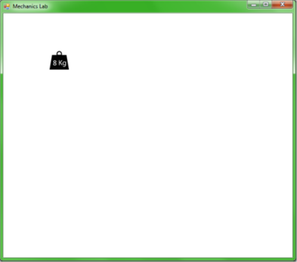
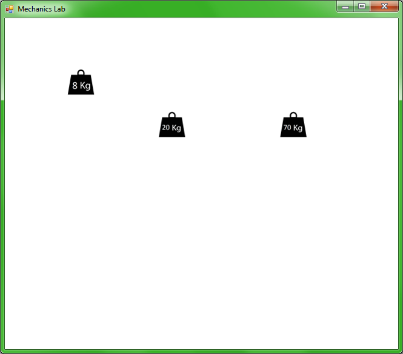
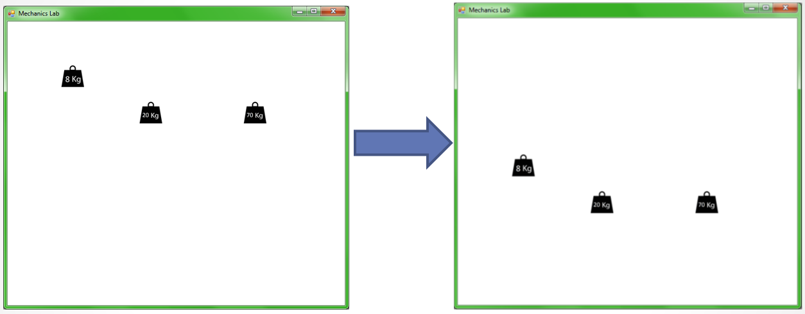

# mechanics-cse-lab
A Java/c# packages to build a mechanics lab from code.  
The idea here is to implemet code packages that will allow to create a virtual lab for learning mechanics.  
The **mechanics-cse-lab** will allow to create objects such-as weight,  inclined plane (ramp), pulley, ball and more.  
The user will be able to constrol the properties of the object within the source-code. Properties such location, weight, velocity and the lab itself -  will be handle via standard API in C#, Java etc.  
The exercises will use both Physics and computer-science knowledge -and allow the students to explore both displince simultaneously.  


# A simple example
MechanicsLab lab = new MechanicsLab();
Weight weight1 = new Weight(8, 100, 80); // 8Kg
lab.add(weight1);

We creates a 8 Kg weight in the location (100,80) in the lab.  



# Another example
```java
MechanicsLab lab = new MechanicsLab();
Weight weight1 = new Weight(8, 100, 80);
Weight weight2 = new Weight(20, 250, 150);
Weight weight3 = new Weight(70, 450, 150);
 
lab.add(weight1);
lab.add(weight2);
lab.add(weight3);
```


# Example
```java
MechanicsLab lab = new MechanicsLab();
lab.add(new Weight(8, 100, 80));
lab.add(new Weight(20, 250, 150));
lab.add(new Weight(20, 250, 150));
lab.setTime(2.1);
```


# Example
```java
MechanicsLab lab = new MechanicsLab();
lab.add(new Weight(8, 100, 80));
lab.add(new Weight(20, 250, 150));
lab.add(new Weight(20, 250, 150));
lab.go();
```

